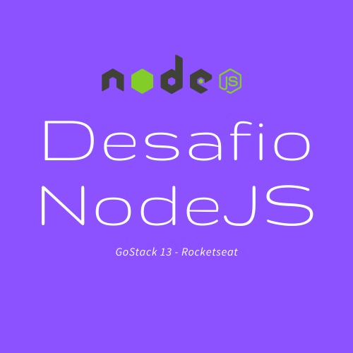

  

<h1 align="center">Desafio NodeJS - GoStack 13 da Rocketseat</h1>

Desafio 2 que se refere à introdução sobre Node.js do Bootcamp GoStack 13, da Rocketseat

<h1 align="center">
  <a href="https://nodejs.org/en/">🚀 NodeJS - Rocketseat</a>
</h1>

  <a href="#techs">Tecnologias</> ◼ 
  <a href="#author">Autor</>

<h4 align="center">
  ⛏ NodeJS 🚀 Em construção 🚧 👷
</h4>

### Features
- [x] Cadastrar Repositório
- [x] Listar Repositórios
- [x] Atualizar Repositório
- [x] Remover Repositório

### Services
- [x] Validar ID do repositório

### Project Updates
- [x] Inserir e Customizar README.md
- [ ] Utilizar TypeScript

  <h3>Tecnologias<h3>
  <ul>
      <li>NodeJS</li>
      <li>ExpressJS</li>
      <li>Nodemon</li>
      <li>Cors</li>
      <li>uuidv4</li>
    </ul>

Autor: Mayron Souza